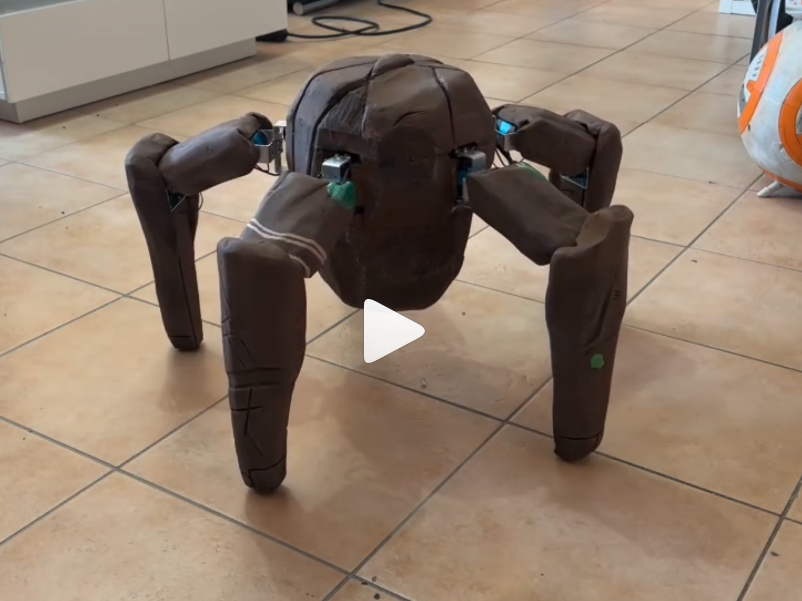

# Multi-leg Robot with invers kinematic
A DIY walking robot with a configurable number of legs (4 to 8), fully 3D-printed and powered by an ESP32 microcontroller.

Have a look at 

## What is This?

This is a multi-legged walking robot with a round body and star-shaped leg arrangement. The number of legs is configurable — anywhere from 4 to 8, depending on the build. Each leg has three joints driven by three servo motors, giving every leg full freedom of movement. A five-legged build, for example, uses 15 servos in total, all coordinated so the robot can walk, turn, and perform gestures.

## Design

**Body:** Round body with legs evenly spaced around the perimeter. In the default five-legged configuration, the body has a radius of approximately 158 mm and the legs are placed at 72° intervals.

**Legs:** Each leg consists of two segments — femur (120 mm) and tibia (175 mm). The hip joint at the body provides two degrees of freedom (lift/lower and lateral swing), while the knee joint adds a third for bending. The three joints per leg are referred to as Coxa, Femur, and Tibia.

**Brain:** An ESP32 microcontroller handles all motion calculations, drives the servos, and hosts a WiFi hotspot for wireless control from a phone or tablet.

**Shell:** All structural parts are 3D-printed.

## How Does It Move?

The robot uses **inverse kinematics** — instead of manually setting angles for each servo, you define where a foot should be in 3D space, and the required joint angles are calculated automatically using trigonometry (law of cosines). This keeps the feet planted on the ground even when the body height changes.

When walking, the robot lifts one or two legs at a time while the remaining legs support the body and push it forward. At low speed, only one leg lifts per phase (more stable). At higher speed, two legs lift simultaneously (faster but less stable). The gait runs as a cyclic phase pattern that adapts to the number of legs in the configuration.

## Controls

On startup, the robot creates its own WiFi hotspot. Connect with your phone and open the control page in a browser. You get:

- A virtual **joystick** for walk direction and speed
- **Sliders** for body tilt (roll, pitch, yaw)
- A **height slider** to raise or lower the body

All inputs are transmitted to the ESP32 in real time via WebSocket.

## Specs

| | |
|---|---|
| **Legs** | 4–8 (configurable) |
| **Servos** | 3 per leg |
| **Microcontroller** | ESP32 |
| **Femur length** | 120 mm |
| **Tibia length** | 175 mm |
| **Body radius** | ~158 mm (default) |
| **Communication** | WiFi (hotspot) + WebSocket |
| **Shell** | 3D-printed |
| **Kinematics** | Inverse kinematics (law of cosines) |
| **Language** | C++ (Arduino framework) |

## Future Plans

- **Sensors:** IMU for automatic body leveling on uneven terrain, foot contact sensors
- **Reinforcement learning:** Training an AI-driven gait, first in simulation (MuJoCo/PyBullet), then transferring to the real robot
- **Range sensor:** Front-facing ToF sensor for obstacle detection

### Stuff to buy
* 3 * Leg-Count ST3020 Servomotors
* Serial Servo Controller-board
* ESP32 Dev Board
* FlySky 6/10 Channel Remote + Reciever

### 3D printing
Inside of the STL Folder you find files for 3D printing.
At the end of the filename you will find a "x5" or similar. 
So with a "x3" you have to print this part 3 times.

### Prepare the Servos
Use my programmer 
https://github.com/JeanetteMueller/SerialServoIdProgrammer
to set all the 1-n ids. 

### Install Libraries
* https://github.com/derdoktor667/FlyskyIBUS
* https://github.com/workloads/scservo

## License & Contact

This is a personal hobby project.